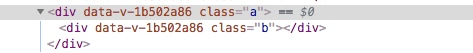
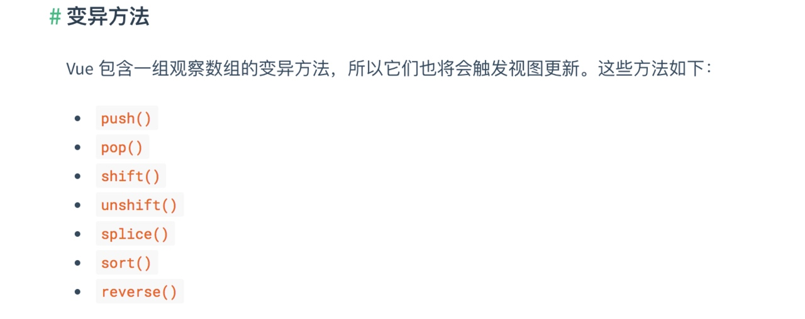

# 初学者没有掌握的 vue 技巧


## 路由跳转setInterval继续运行并没有销毁

**场景**

比如一些弹幕，走马灯文字，这类需要定时调用的，路由跳转之后，因为组件已经销毁了，但是setlnterval还没有销毁，还在继续后台调用，控制台会不断报错，如果运算量大的话，无法及时清除，会导致严重的页面卡顿

**解决方法**

在组件生命周期beforeDestroy停止setInterval

```JS
created() {
   this.intervalid = setInterval(() => {
      this.layerError = "";
      this.Timer = null;
  }, 100000);
}
beforeDestroy( ){
    //我通常是把setInterval( )定时器赋值给this实例，然后就可以像下面这么暂停。
    clearInterval(this.intervalid);
}
```
  
  
## Vue路由拦截浏览器后退实现草稿保存类似需求

**场景**

为了防止用户突然离开，没有保存已输入的信息

```JS
//在路由组件中:mounted(){}，
beforeRouteLeave (to, from, next) {
  if(用户已经输入信息){
    //出现弹窗提醒保存草稿，或者自动后台为其保存
  }else{
    next(true);//用户离开
  }
}
```
  
## 自定义组件添加click等事件不生效

**场景**

一些自定义组件，需要额外添加一些事件来实现一些特定需求

```JS
  <template>
    <el-progress type="circle" :percentage=“0" @click=“stopProgress”></elprogress>
  </template>
  <script>
    export default {
       methods:{
            stopProgress() { 
            console.log('停止')
            }
        }
    }
  </script>
```

**解决办法**

使用.native修饰符

```JS
  <template>
    <el-progress type="circle" :percentage=“0" @click.native=“stopProgress”></el-progress>
  </template>
  <script>
    export default {
        methods:{
            stopProgress() { 
            console.log('停止')
            }
        }
    }
  </script>
```

## 深度作用选择器

**场景**

scoped的组件样式，希望影响到子组件的默认样式


  
在样式中设置完scoped在浏览器解析为如下图这样，a是个div，a div里面包含一个组件里面解析完了div的样式名字为b，想在父组件影响到子组件的默认样式。
  
**解决方法**

```JS
<style scoped>
    .a >>> .b { /* ... */ }
</style>
//有些像Sass之类的预处理器无法正确解析>>>。这种情况下你可以使用/deep/操作符取而代之- - - -这是一个>>>的别名，同样可以正常工作。
<style scoped lang=“scss”>
    .a /deep/ .b { /* ... */ }
</style>
```

## Vue数组/对象更新视图不更新

**场景**

很多时候我们习惯于这样操作数组和对象

```JS
  data() { 
    return {
        arr: [1,2,3],
        obj:{
          a: 1,
          b: 2 
        }
    }; 
  },
​
  // 数组更新视图不更新
  this.arr[0] = 'OBKoro1';
  this.arr.length = 1;
  console.log(arr);// ['OBKoro1']; 
  // 数据更新，对象视图不更新    
  this.obj.c = 'OBKoro1';
  delete this.obj.a;
  console.log(obj);  // {b:2,c:'OBKoro1'}
```

**方法**

- this. $set(你要改变的数组/对象，你要改变的位置/key,你要改成什么value)
- 数组原生方法触发视图更新
- 整体替换数组/对象




## Vue深度watch与watch立即触发回调

**场景**

在watch里面监测对象里面对应的值是监测不到的

**解决方法**

- 选项: deep, 在选项参数中指定deep:true,可以监听对象中子属性的变化。
- 选项: immediate, 在选项参数中指定immediate:true, 将立即以表达式的当前值触发回调，也就是默认触发一次。

```JS
watch: {
    obj: {
        handler(val, oldVal) {
          console.log('属性变化触发这个回调',val, oldVal); 
        },
        deep: true // 监测这个对象中每一个属性的变化
    },
    step: {
       handler(val, oldVal) {
        console.log("默认触发一次", val, oldVal); 
       },
       immediate: true // 默认触发一次
    }
}
```
